[README.md](https://github.com/user-attachments/files/29500128/README.md)

 

---

### I build AI-native ventures in regulated markets — healthcare, insurance & financial services — across MENA and India.

Over a decade inside the operational machinery of regulated industries — group medical insurance, labour law, compliance, large-scale workforce systems — gave me a ground-level view of how these markets actually work, where they break, and what it takes to enter them without getting stuck. My focus today is **medicAI**. Everything below is selective.

---

## 🚀 Building

<table>
<tr>
<td width="60" align="center" valign="top">

### 🩺

</td>
<td valign="top">

### medicAI &nbsp;·&nbsp; `Co-Founder`
AI-native infrastructure rethinking healthcare and health-insurance access across MENA.

**My contribution —** Conceived and built medicAI into a proven, deployed product now working with multiple insurance providers. I lead product, the regulatory/distribution design, and the partnership pipeline that turns coverage into something simpler and more reachable. **More on the next chapter soon.**

</td>
</tr>

<tr>
<td width="60" align="center" valign="top">

### 📑

</td>
<td valign="top">

### tanim.ai &nbsp;·&nbsp; `Co-Founder`
Insurance distribution platform — lets insurers list their products for distribution and drive new revenue channels.

**My contribution —** Co-built the distribution model and commercial architecture connecting insurers to scalable channels, and the go-to-market strategy that turns product listings into revenue.

</td>
</tr>

<tr>
<td width="60" align="center" valign="top">

### 🔐

</td>
<td valign="top">

### DocChat &nbsp;·&nbsp; `Founder`
CBUAE-compliant KYC and document-intelligence SaaS for regulated financial institutions in the UAE.

**My contribution —** Founded the venture end-to-end. I set the product direction and the compliance architecture that automates identity verification and document workflows under central-bank standards.

</td>
</tr>

<tr>
<td width="60" align="center" valign="top">

### 🎾

</td>
<td valign="top">

### Swinder &nbsp;·&nbsp; `Founder`
Sports matchmaking platform for recreational athletes — find players, join matches, build teams, book courts across padel, tennis, football & basketball.

**My contribution —** Founded and shaped the product vision and the two-sided model connecting players to venues. → **[swinder.me](https://www.swinder.me)**

</td>
</tr>

<tr>
<td width="60" align="center" valign="top">

### ⚙️

</td>
<td valign="top">

### AgileCatalyst.ai &nbsp;·&nbsp; `SVP, Revenue Operations`
Turning market gaps into fundable businesses.

**My contribution —** I build the commercial engines, partnership pipelines, and go-to-market systems that move ventures from idea to revenue.

</td>
</tr>
</table>

---

## 🪑 Board Roles

> Selective governance seats in regulated, infrastructure-grade markets — advisory, not operating commitments.

<table>
<tr>
<td width="60" align="center" valign="top">

### 🧩

</td>
<td valign="top">

### itecverse &nbsp;·&nbsp; `Non-Executive Board Member`
Enterprise ERP software company. Advisory and governance role.

</td>
</tr>
<tr>
<td width="60" align="center" valign="top">

### 🔧

</td>
<td valign="top">

### Synergy Software Systems &nbsp;·&nbsp; `Non-Executive Board Member`
ERP implementation and consulting firm. Advisory and governance role.

</td>
</tr>
</table>

---

### What I do well
**Spotting structural gaps in large markets** · **Building the partnerships & commercial architecture to close them** · **Bringing the right people together to execute**

 

*Impact measured in access, sustainable growth, and businesses that hold up under real-world conditions.*

 

